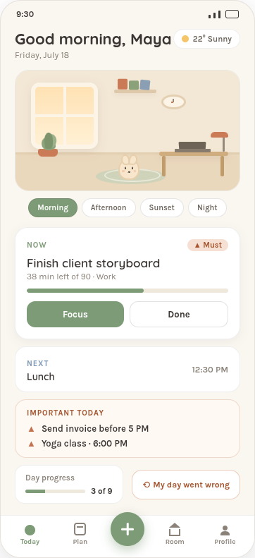
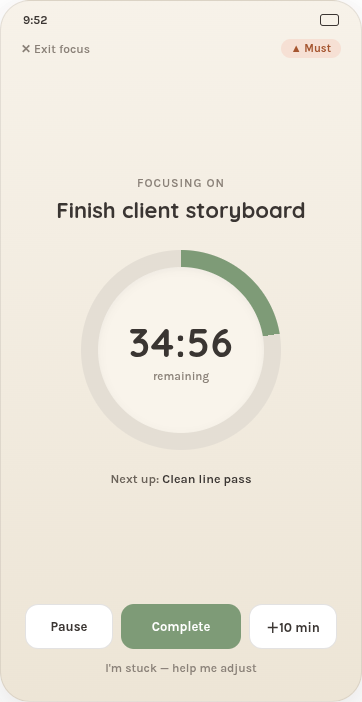
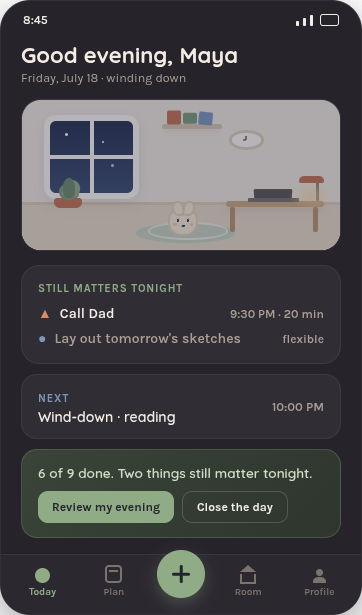
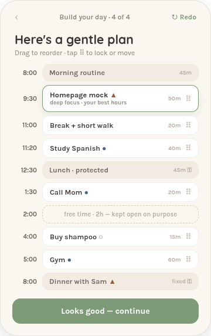
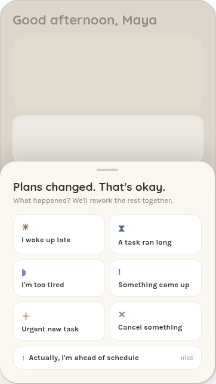
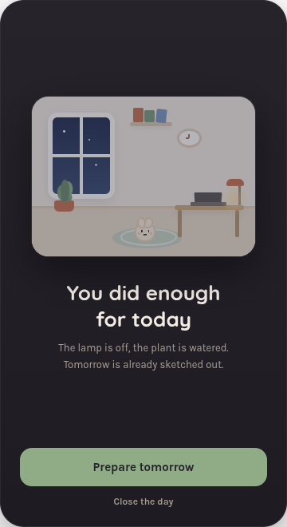
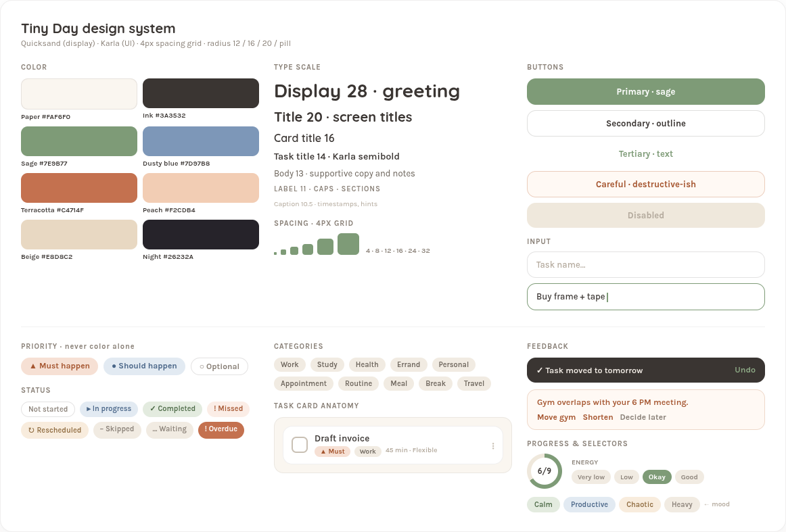
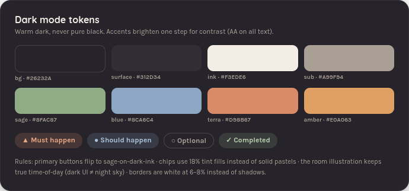

# Tiny Day

A cozy daily planner. Your day, made manageable.

Tiny Day is a fully offline React Native (Expo) app: no account, no cloud, no analytics. You brain-dump your day in plain language, it shapes a gentle timeline, and a tiny illustrated room lives alongside you — brightening as things get done, dimming into lamplight at night. When life happens, one tap repairs the day without guilt.

<p align="center">
  
  
  
</p>

## Features

- **The Room** — a layered SVG scene (window sky, lamp glow, tint overlay, tiny character) with four time states plus a rain variant. It follows the real clock and reflects completion.
- **Morning planning** — brain-dump text is parsed into task cards (name, category, duration, priority, time heuristics), then a priority and energy pass builds a timeline with protected meals and free time kept open on purpose.
- **Daily loop** — Now/Next/Important cards, a real countdown focus timer (pause / +10 min / complete), quick-add with natural-language parsing ("call the framer tomorrow at 4").
- **"My day went wrong"** — pick what changed (woke late, ran long, too tired, urgent thing); Tiny Day moves optionals, shortens flexibles, protects ▲ musts and fixed appointments, inserts rest, and shows the changes before applying. *"Your day has been repaired."*
- **Evening** — mood check-in, gentle stats, leftovers triage (tomorrow / backlog / let go — never auto-carry). *"You did enough for today."*
- **Notifications** — ▲ must = remind + one follow-up · ● should = one reminder · ○ optional = silent. Quiet hours, privacy mode ("Important reminder due now"), and at most one gentle replan prompt. No streaks, no guilt.
- **Plan tab** — Tomorrow, Week, Backlog, and a Routine builder with per-day scheduling.
- **Accessibility** — 44px+ touch targets, dynamic type, reduce-motion and high-contrast toggles, screen-reader labels, and priority always shown as glyph + label, never color alone.
- **Tablet** — sidebar navigation and wide layouts at ≥768px.

<p align="center">
  
  
  
</p>

## Design system

Quicksand (display) + Karla (UI) · 4px spacing grid · radii 12/16/20/pill.

Light: paper `#FAF6F0`, ink `#3A3532`, sage `#7E9B77`, dusty blue `#7D97B8`, terracotta `#C4714F`, peach `#F2CDB4`, beige `#E8D8C2`.
Dark (never pure black): bg `#26232A`, surface `#312D34`, ink `#F3EDE6`, with 18% tint chip fills and white borders at 6–8%.

<p align="center">
  
  
</p>

The full 65-screen design spec lives in [docs/screens/](docs/screens/) — see [INDEX.txt](docs/screens/INDEX.txt) for the naming scheme ([10a](docs/screens/10a-navigation-map.png) is the navigation map, [10b](docs/screens/10b-user-flow.png) the user journey).

## Stack

- Expo SDK 57 · TypeScript · expo-router
- Zustand + AsyncStorage (all data local; works fully offline)
- react-native-svg (the Room) · react-native-reanimated · expo-haptics
- expo-notifications (local only) · expo-google-fonts (Quicksand, Karla)

## Run it

```bash
npm install
npx expo start        # then press a for Android, i for iOS, w for web
npm run typecheck     # tsc --noEmit
```

## Project layout

```
app/            expo-router screens (tabs, onboarding, planning, replan, evening, focus…)
components/     design-system components (TaskCard, chips, ProgressRing, BottomSheet, Room…)
theme/          light/dark tokens, type scale, ThemeProvider
lib/            types, zustand stores, NL parsing, scheduler, repair engine, notifications
docs/screens/   the 65-screen design reference
```

## Startup time

The app starts in ~1s once the JS bundle is local. In a Metro-backed debug
build, expect ~10-15s instead: roughly 6.5s to download the 3.4MB dev bundle
over adb and ~2.7s to evaluate it unminified. That cost is the dev server, not
the app — a production bundle removes it entirely.

## Known issue: production bundles render blank

Debug builds (Metro, `__DEV__` true) work. Every production build renders a
permanently blank screen. The process sits at 0% CPU with all threads asleep:
the JS event loop is idle but never pumped, so `setTimeout` and
`requestAnimationFrame` never fire and Fabric never mounts a view. Promises
still resolve, because Hermes drains microtasks itself without the native
scheduler.

Minimal reproduction — no router, no navigation, no animation library:

```jsx
function Probe() {
  const [n, setN] = useState(0);
  useEffect(() => { setInterval(() => setN((x) => x + 1), 700); }, []);
  console.log('render n=' + n);   // logs once, n=0
  return <Text>TICK {n}</Text>;    // never paints
}
registerRootComponent(Probe);
```

Ruled out by bisection, each with a rebuilt or re-bundled APK:

| Hypothesis | Result |
|---|---|
| Expo SDK 57 regression | also fails on SDK 56 / RN 0.85.3 |
| App code | minimal 2-file router app fails |
| expo-router | non-router `registerRootComponent` app fails |
| Hermes bytecode | fails with a plain-JS bundle swapped into the APK |
| Minification | fails unminified |
| `react-native-reanimated` / worklets | fails with both removed |
| Font loading gate | fails with a 2s timeout fallback |
| Splash screen | logs `splash hidden OK`, still blank |
| Missing `metro.config.js` | fails after adding the standard config |
| APK signing / ProGuard | debug-signed bundle swap fails; ProGuard off |
| Screen off / backgrounding | fails with screen on and `stayon true` |
| First launch vs. relaunch | fails on launches 1, 2 and 3 |
| Legacy architecture | unavailable — RN 0.82+ removed it |
| JSC instead of Hermes | untestable — worklets requires Hermes |

One run of a plain-JS probe *did* tick correctly, but that result could not be
reproduced afterwards under the same conditions, so it should be treated as an
artifact rather than a fix.

Next step is a build on a known-good toolchain (`eas build -p android --profile
preview`) to separate a local toolchain fault from an upstream bug. Until then,
run the app with `npx expo start` + `npx expo run:android`.
